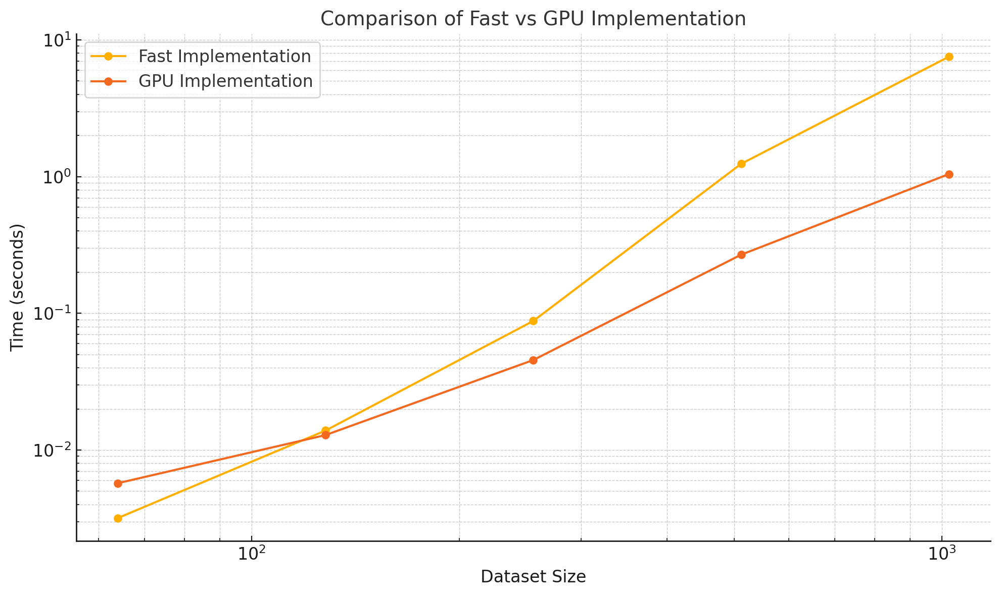

# MiniTorch Module 3


- Docs: <https://minitorch.github.io/>

- Overview: <https://minitorch.github.io/module3.html>

You will need to modify `tensor_functions.py` slightly in this assignment.

- Tests:

```
python run_tests.py
```

- Note:

Several of the tests for this assignment will only run if you are on a GPU machine and will not
run on github's test infrastructure. Please follow the instructions to setup up a colab machine
to run these tests.

This assignment requires the following files from the previous assignments. You can get these by running

```bash
python sync_previous_module.py previous-module-dir current-module-dir
```

The files that will be synced are:

        minitorch/tensor_data.py minitorch/tensor_functions.py minitorch/tensor_ops.py minitorch/operators.py minitorch/scalar.py minitorch/scalar_functions.py minitorch/module.py minitorch/autodiff.py minitorch/module.py project/run_manual.py project/run_scalar.py project/run_tensor.py minitorch/operators.py minitorch/module.py minitorch/autodiff.py minitorch/tensor.py minitorch/datasets.py minitorch/testing.py minitorch/optim.py

# 3.4

Comparison of fast versus GPU implementation


# 3.5

## Split dataset

- CPU

HIDDEN == 100
RATE == 0.05
'<br>Epoch 10 loss 5.939196570646645 correct 38<br><br>Epoch 20 loss 3.8669754122063877 correct 38<br><br>Epoch 30 loss 3.923247564285025 correct 49<br><br>Epoch 40 loss 2.5593145892870632 correct 47<br><br>Epoch 50 loss 3.2355314278314062 correct 47<br><br>Epoch 60 loss 2.279096833179473 correct 48<br><br>Epoch 70 loss 2.0040335818006065 correct 49<br><br>Epoch 80 loss 2.5718929291207044 correct 49<br><br>Epoch 90 loss 2.246454839483184 correct 47<br><br>Epoch 100 loss 1.177294094189414 correct 50<br><br>Epoch 110 loss 0.6083474465966286 correct 49<br><br>Epoch 120 loss 1.4333995817306913 correct 49<br><br>Epoch 130 loss 2.5144557086775987 correct 49<br><br>Epoch 140 loss 0.9410934822370635 correct 50<br><br>Epoch 150 loss 1.1067976756791482 correct 50<br><br>Epoch 160 loss 0.2111851647269684 correct 50<br><br>Epoch 170 loss 1.30811879161813 correct 50<br><br>Epoch 180 loss 1.241589666274276 correct 49<br><br>Epoch 190 loss 1.075732104201979 correct 50<br><br>Epoch 200 loss 0.6099714193471729 correct 50<br><br>Epoch 210 loss 0.7065721974271353 correct 49<br><br>Epoch 220 loss 0.5172611201004272 correct 50<br><br>Epoch 230 loss 0.9784998273386808 correct 49<br><br>Epoch 240 loss 0.6008629746732085 correct 50<br><br>Epoch 250 loss 0.7174548061997001 correct 50<br><br>Epoch 260 loss 0.13159296166910406 correct 49<br><br>Epoch 270 loss 0.4941205284764242 correct 49<br><br>Epoch 280 loss 1.180667925330143 correct 50<br><br>Epoch 290 loss 0.3721911166078714 correct 50<br><br>Epoch 300 loss 0.09408163829936197 correct 50<br><br>Epoch 310 loss 0.8568741539027727 correct 50<br><br>Epoch 320 loss 0.5201966197327234 correct 50<br><br>Epoch 330 loss 0.14397739530675113 correct 50<br><br>Epoch 340 loss 0.14465584352077016 correct 50<br><br>Epoch 350 loss 0.5960167533703391 correct 50<br><br>Epoch 360 loss 1.3355282541358586 correct 50<br><br>Epoch 370 loss 0.7472812355704432 correct 50<br><br>Epoch 380 loss 0.40098931185020353 correct 50<br><br>Epoch 390 loss 1.1767958702216714 correct 50<br><br>Epoch 400 loss 0.8817203763325175 correct 50<br><br>Epoch 410 loss 0.6296499680727419 correct 50<br><br>Epoch 420 loss 0.18612716712619157 correct 50<br><br>Epoch 430 loss 0.0267227332996031 correct 50<br><br>Epoch 440 loss 0.5423504942798877 correct 50<br><br>Epoch 450 loss 0.5467647926146113 correct 50<br><br>Epoch 460 loss 0.27677668718481413 correct 50<br><br>Epoch 470 loss 0.17399736897060883 correct 50<br><br>Epoch 480 loss 0.164344204535682 correct 50<br><br>Epoch 490 loss 0.018616263577322625 correct 50<br><br><br><br>real 1m36.348s<br><br>user 1m53.450s<br>sys 0m22.012s<br><br><br>

Time per epoch: TODO

- GPU
  HIDDEN == 100
  RATE == 0.05

epoch 0 loss 12.630264538911412 correct 30<br><br> Epoch 10 loss 6.8012516966399605 correct 38<br><br> Epoch 20 loss 4.094497703609665 correct 41<br><br> Epoch 30 loss 3.848571015463426 correct 40<br><br> Epoch 40 loss 3.624139367875117 correct 47<br><br> Epoch 50 loss 3.826780117609339 correct 47<br><br> Epoch 60 loss 1.5201415488949266 correct 46<br><br> Epoch 70 loss 2.1135569466158386 correct 49<br><br> Epoch 80 loss 1.2725205000446869 correct 48<br><br> Epoch 90 loss 1.3149157634041029 correct 48<br><br> Epoch 100 loss 1.2289459217233114 correct 48<br><br> Epoch 110 loss 1.6972053372514915 correct 48<br><br> Epoch 120 loss 0.991677905899511 correct 49<br><br> Epoch 130 loss 1.9058861645687952 correct 48<br><br> Epoch 140 loss 1.3870909820346107 correct 49<br><br> Epoch 150 loss 2.1167258247774576 correct 48<br><br> Epoch 160 loss 1.3883336745961319 correct 48<br><br> Epoch 170 loss 1.2167089490880352 correct 50<br><br> Epoch 180 loss 1.5936928247949662 correct 48<br><br> Epoch 190 loss 0.37432530810052567 correct 49<br><br> Epoch 200 loss 0.7342899558727634 correct 48<br><br> Epoch 210 loss 0.330424340011278 correct 49<br><br> Epoch 220 loss 0.4358640259332716 correct 49<br><br> Epoch 230 loss 2.3709273098857113 correct 47<br><br> Epoch 240 loss 0.7214441423609054 correct 49<br><br> Epoch 250 loss 0.16680242409162035 correct 49<br><br> Epoch 260 loss 0.6062424653470613 correct 49<br><br> Epoch 270 loss 0.6470308484405015 correct 49<br><br> Epoch 280 loss 0.3383282117142036 correct 49<br><br> Epoch 290 loss 1.324359537913472 correct 48<br><br> Epoch 300 loss 0.7782194022943452 correct 49<br><br> Epoch 310 loss 1.2556183881616956 correct 49<br><br> Epoch 320 loss 0.12947141106760385 correct 48<br><br> Epoch 330 loss 0.20943624253952026 correct 49<br><br> Epoch 340 loss 0.14769240953729318 correct 49<br><br> Epoch 350 loss 0.36540662157474607 correct 49<br><br> Epoch 360 loss 0.9265681798941044 correct 50<br><br> Epoch 370 loss 0.11813059478280771 correct 49<br><br> Epoch 380 loss 0.35135822931873556 correct 49<br><br> Epoch 390 loss 0.2785882243422717 correct 49<br><br> Epoch 400 loss 2.4028001222889444 correct 48<br><br> Epoch 410 loss 0.35377466894206355 correct 49<br><br> Epoch 420 loss 0.3079692450423886 correct 49<br><br> Epoch 430 loss 0.11439669729133134 correct 49<br><br> Epoch 440 loss 0.04062241855255273 correct 48<br><br> Epoch 450 loss 0.04783586131659016 correct 48<br><br> Epoch 460 loss 0.2614344612962089 correct 50<br><br> Epoch 470 loss 1.6584739600839131 correct 48<br><br> Epoch 480 loss 0.2062178637794117 correct 49<br><br> Epoch 490 loss 0.18108356568319925 correct 50<br><br> <br><br> real 12m43.214s<br><br> user 12m34.442s<br><br> sys 0m4.828s<br>

Time per epoch: 1.526s

## XOR Dataset

- GPU
